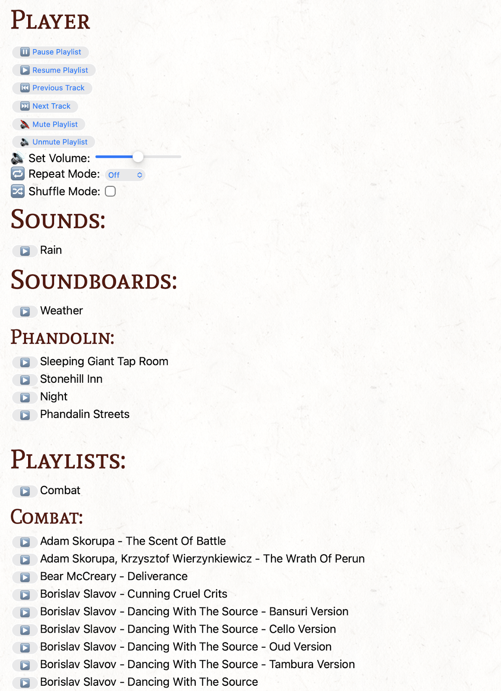

# Details

This repo contains an module to be used with [Module Packer](https://github.com/encounterplus/module-packer)



## Modified Kenku.FM build
**The regular version of Kenku.FM will not work!**

The current kenku.fm build does not support CORS requests, which are required to enable encounter+ to talk to kenku.fm.

There is an open pull request to add this feature since May 2023: https://github.com/owlbear-rodeo/kenku-fm/pull/99
Please voice your support on this issue to encourage the developer to merge it in to the official build!

I have build the latest source code with these modifications. They can be downloaded here: https://private.goscik.com/kenku

You might get a warning about the code being unsigned when it launches, if you close the dialog, it should start and work as expected.

# How to use

Four custom HTML tags are provided to generate Kenku.FM controls.
To use these you will need to replace the ID values with ones from your kenku.fm setup.

For playlists/soundboards this can be found by opening them, clicking the "three dot" icon in the top left and clicking "copy id"

For tracks and sounds, the process is similar but you need to click the three dots associated with that track/sound.


## kenku-sound
This will allow you to play/stop individual sounds from a soundboard
```
<kenku-sound id="ID"></kenku-sound>
```

## kenku-soundboard
This will allow you to play a soundboard. By default it will display a single play icon for the whole soundboard and it will randomly select a sound to start playing.

If `class="full"` is added, it will create individual buttons for each sound on a soundboard.

```
<kenku-soundboard id="ID"></kenku-soundboard>
<kenku-soundboard id="ID" class="full"></kenku-soundboard>
```

## kenku-track
Works very similar to the `kenku-sound` except for tracks in playlists.

One thing to note about tracks/playlists is that only one can ever be playing at a time, and they cannot be stopped, only paused
```
<kenku-track id="ID"></kenku-track>
```


## kenku-playlist
Works very similar to the `kenku-soundboard` except for playlists.

One thing to note about tracks/playlists is that only one can ever be playing at a time, and they cannot be stopped, only paused

```
<kenku-playlist id="ID"></kenku-playlist>
<kenku-playlist id="ID" class="full"></kenku-playlist>
```

# Other Kenku controls

Examples are provided for other HTML elements that can be added to interact with kenku.fm

```
<button onclick="kenkuFM.playlist_pause()">⏸️ Pause Playlist</button></br>
<button onclick="kenkuFM.playlist_resume()">▶️ Resume Playlist</button></br>
<button onclick="kenkuFM.playlist_previous()">⏮️ Previous Track</button></br>
<button onclick="kenkuFM.playlist_next()">⏭️ Next Track</button></br>
<button onclick="kenkuFM.playlist_mute()">🔇 Mute Playlist</button></br>
<button onclick="kenkuFM.playlist_mute(false)">🔊 Unmute Playlist</button></br>
<label for="volumeSlider">🔊 Set Volume:</label>
<input type="range" id="volumeSlider" min="0" max="1" step="0.01" value="0.5"
        oninput="kenkuFM.playlist_set_volume(this.value)"></br>
<label for="repeatMode">🔁 Repeat Mode:</label>
<select id="repeatMode" onchange="kenkuFM.playlist_repeat(this.value)">
    <option value="off">Off</option>
    <option value="track">Track</option>
    <option value="playlist">Playlist</option>
</select></br>
<label for="shuffleCheckbox">🔀 Shuffle Mode:</label>
<input type="checkbox" id="shuffleCheckbox" onchange="kenkuFM.playlist_shuffle(this.checked)">
```

Please see the `KenkuAPI` class in [module/assets/js/custom.css](./module/assets/js/custom.css) for the full functionality exposed by kenku.fm (most of it is covered above)

# Autoplay

It is possible to create pages that autoplay sounds/tracks as soon as they are viewed. For example this could be used for a map marker that when opened automatically plays the correct music and ambience sounds for a map.

To do so you need to include the following script somewhere on a page:

```
<script>
    function autoplay() {
        kenkuFM.soundboard_play('92ac26d4-b630-4c0f-bafa-87c27989d10a') // Can be a soundboard or a sound from a soundboards
        kenkuFM.playlist_pause() // Playing the same track/playlist multiple times can fail if not paused first
        kenkuFM.playlist_play('c995ac6e-d934-464c-847a-c72d5e7ed403')  // Can be a playlist or a track
    
    }
</script>
```